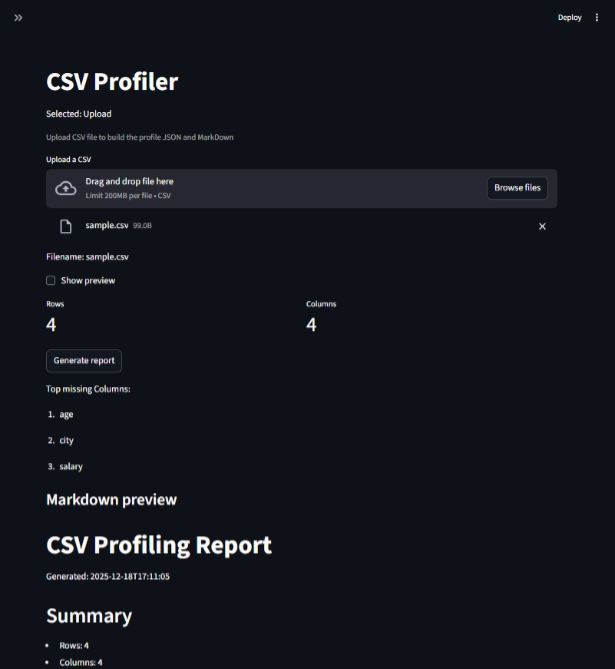

# CSV Profiler

Generate a profiling report for a CSV file.

## Features
- CLI: JSON + Markdown report
- Streamlit GUI: upload CSV + export reports

## Setup
    uv venv -p 3.11
    uv pip install -r requirements.txt

## Run CLI
If you have a src/ folder:
```
    #   Mac/Linux: export PYTHONPATH=src
    #   Windows:   $env:PYTHONPATH="src"
```
Run this:
```
    uv run python -m csv_profiler.cli data/sample.csv
```
optional setting for the profiling:
- `--report-name <report>`
- `--out-dir outputs <outputs>`
- `--preview`


## Run GUI
If you have a src/ folder:
```
    #   Mac/Linux: export PYTHONPATH=src
    #   Windows:   $env:PYTHONPATH="src"
```
Run this:
```
    uv run streamlit run app.py
```

open `http://localhost:8501/`



---

## Output Files

The CLI writes:
- `outputs/report.json`
- `outputs/report.md`

The Streamlit app can:
- Upload and preview the report
- download JSON + Markdown

Note: conflict check

Note: main